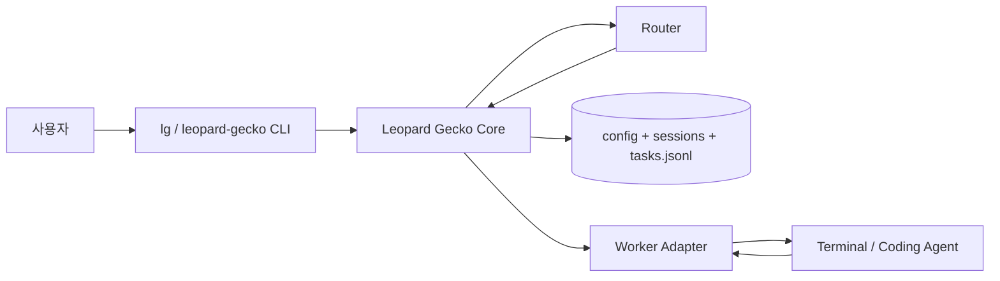

# Leopard Gecko — 기술 기획안

> **Leopard Gecko**는 단일 사용자 인터페이스 뒤에서 여러 코딩 에이전트 터미널 세션을 관리하는 **컨텍스트 라우팅 오케스트레이터**다. 구현 언어는 **Python**이다.  
> 제품 철학·워크플로·MVP 범위는 [`init.md`](./init.md)와 동일한 전제를 둔다. 이 문서는 그 위에 **모듈 구조, 데이터 계약, 동시성, 라우팅 구현 전략, CLI·확장 포인트**를 구체화한다.

---

## 1. 시스템 경계

| 구성 요소 | 책임 |
|-----------|------|
| **Leopard Gecko Core** | task 생성, `sessions.json` / task 로그 갱신, 라우팅 결정, 세션·글로벌 큐 관리, 설정 로드 |
| **Router (판단기)** | `user_prompt`, `task_note`, 세션 상태·`task_history`를 입력으로 받아 `assigned_session_id` 또는 `new_session` / `global_queue` 결정 |
| **Worker 어댑터** | 실제 코딩 에이전트(터미널 세션)에 **user_prompt만** 전달하고, 완료·실패·하트비트를 Core에 보고하는 플러그인 경계 |
| **저장소** | `config.json`, `sessions.json`, `tasks.jsonl` (append-only) |

Core는 **프롬프트 재작성(refine)을 하지 않는다.** Router가 LLM을 쓰더라도 그 출력은 **라우팅 메모(`task_note`)와 내부 reasoning 로그**에만 쓰이고, Worker로는 **원문 `user_prompt`만** 전달한다.



---

## 2. Python 기술 스택 (권장)

| 영역 | 선택 | 비고 |
|------|------|------|
| 런타임 | Python 3.12+ | 타입 힌트·`TypedDict`·`dataclass` / Pydantic v2 |
| 패키징·의존성 | Rye | [`init` 사용자 규칙] |
| CLI | Typer + Rich | 서브커맨드, 테이블·진행 표시 |
| 설정·스키마 | Pydantic Settings + JSON 파일 로드 | `config.json` 검증 |
| 동시성 | `asyncio` (선택) + 파일 락 | 단일 머신 MVP는 동기 + `filelock`도 가능 |
| 테스트 | pytest | Core·Router 순수 로직 위주 |
| 스타일 | Ruff | format + lint |

Worker 어댑터는 **구체 터미널 도구**(tmux, Cursor Agent CLI 등)에 묶이지 않도록 **인터페이스만 Core에 정의**하고, MVP에서는 스텁 또는 최소 구현으로 시작한다.

---

## 3. 패키지·모듈 구조 (초안)

```
leopard_gecko/
  pyproject.toml
  src/
    leopard_gecko/
      __init__.py
      cli/                 # Typer 엔트리포인트
        main.py
      models/              # Pydantic: Task, Session, Config, Enums
        task.py
        session.py
        config.py
      store/               # JSON/JSONL 읽기·쓰기, 락, 원자적 갱신
        paths.py
        sessions_repo.py
        tasks_log.py
      router/              # 라우팅 정책 + (선택) LLM 클라이언트
        policy.py
        llm_router.py      # optional: API 키 있을 때만
      orchestrator/        # “한 번의 사용자 입력” 처리 파이프라인
        pipeline.py
      adapters/            # WorkerPort 프로토콜 구현체
        base.py
        noop.py
  tests/
```

**의존성 방향:** `cli` → `orchestrator` → `router`, `store`, `models`. `adapters`는 Core가 정의한 **프로토콜**에만 의존한다.

---

## 4. 데이터 계약

### 4.1 `config.json`

| 필드 | 타입 | 설명 |
|------|------|------|
| `max_terminal_num` | int | 동시에 살릴 수 있는 터미널(세션) 상한 |
| `session_idle_timeout_min` | int | 이 시간 이상 heartbeat 없으면 dead 후보 |
| `queue_policy` | object | 예: `max_queue_per_session` (세션당 큐 길이 상한), 초과 시 다른 세션 또는 글로벌 큐로 우회하는 규칙 |
| `data_dir` | string (optional) | 상태 파일 루트; 기본은 `~/.leopard-gecko` 또는 프로젝트 `.leopard-gecko` |

### 4.2 `sessions.json` — 단일 진실 원천(세션 뷰)

- **역할:** 살아 있는 세션 레지스트리 + **누적 `task_history`** (라우팅의 근거).
- **동시 쓰기:** 짧은 임시 파일에 쓴 뒤 `rename`으로 교체하거나, `filelock`으로 배타 잠금. MVP는 단일 프로세스만 가정해도 되나, CLI와 worker 보고가 겹칠 수 있어 **락 또는 원자적 쓰기**를 초기부터 넣는 편이 안전하다.

**세션 엔트리 (논리 필드):**

| 필드 | 설명 |
|------|------|
| `session_id` | 불변 식별자 |
| `terminal_id` | 외부 터미널/슬롯 ID (어댑터가 채움) |
| `status` | `idle` \| `busy` \| `blocked` \| `dead` |
| `current_task_id` | 현재 실행 중이면 해당 task, 없으면 null |
| `queue` | `task_id` 문자열 배열 (순서대로 대기) |
| `task_history` | 완료·실패·실행 중 스냅샷 누적 (init 예시와 동일 철학) |
| `worktree_path` | session 전용 git worktree 경로. 비활성 시 null |
| `worktree_branch` | session worktree가 체크아웃한 브랜치명. 비활성 시 null |
| `worktree_base_ref` | worktree를 만들 때 기준으로 삼은 ref/commit. 비활성 시 null |
| `created_at` / `last_heartbeat` | ISO8601 UTC |

### 4.3 `tasks.jsonl`

- **append-only** 이벤트 로그: task 생성, 라우팅 결정 변경, 큐 상태 전이, 완료/실패.
- 한 줄 = 하나의 JSON 객체 (이벤트 타입 필드로 구분).
- `sessions.json`과 중복되더라도 **감사·재현·디버깅**용으로 유지한다.

### 4.4 Task (런타임 모델)

[`init.md`](./init.md)와 동일하게 유지:

- `task_id`, `user_prompt`, `task_note`, `routing`, `queue_status`, `created_at`
- `queue_status`: `pending` \| `queued_in_session` \| `queued_globally` \| `running` \| `completed` \| `failed`

---

## 5. 라우팅 구현 전략

라우팅은 **정책 함수**로 캡슐화한다.

**입력:** 새 task (`user_prompt`, `task_note`), `config`, `sessions` 스냅샷, (선택) 현재 글로벌 큐 길이.

**출력:** 판별 결과 하나:

- `AssignExisting(session_id)` — idle이면 즉시 할당 가능, busy면 해당 세션 `queue`에 추가
- `CreateNewSession` — `max_terminal_num` 미만일 때만
- `EnqueueGlobal` — 터미널 한도 또는 “붙일 세션 없음” 등

**MVP 구현 옵션 (단계적):**

1. **휴리스틱만:** `task_note` + 최근 N개 `task_history`의 `user_prompt`를 문자열로 이어붙여 키워드·간단 규칙 (비용 0, 재현 쉬움).
2. **LLM 라우터:** 구조화 출력(JSON)으로 위 세 가지 중 하나 + `reason` + `confidence`. temperature 낮게. **Worker에는 절대 task_note를 넣지 않음.**
3. **하이브리드:** 휴리스틱으로 후보 세션 2~3개만 줄이고 LLM은 최종 선택만.

[`init.md`](./init.md)의 우선순위(자연스러운 이어짐 → context rot 회피 → 새 세션 → 글로벌 대기)를 `policy.py`에 **명시적 주석 + 단위 테스트 케이스**로 고정한다.

---

## 6. 오케스트레이션 파이프라인 (한 번의 사용자 입력)

1. **입력 검증** — 빈 프롬프트 거부.
2. **task_id 발급** — 시간 + 짧은 랜덤 suffix 등 충돌 방지.
3. **task_note 생성** — Router의 부분집합 또는 별도 “노트 작성” LLM 호출 (한두 줄). **이 단계 출력은 저장·라우팅에만 사용.**
4. **`sessions.json` 로드 (락)** — 스냅샷.
5. **라우팅** — 위 절 출력 적용.
6. **상태 갱신** — 세션 `queue` / `current_task_id` / 글로벌 큐 구조체 갱신.
7. **`tasks.jsonl` append** — 생성 이벤트 + 라우팅 이벤트.
8. **`sessions.json` 원자적 저장.**
9. **Session worktree 준비** — worktree 모드가 켜져 있으면 session별 checkout 디렉터리를 보장한다.
10. **Worker 어댑터 호출** — “다음 실행할 task가 있으면” `user_prompt`만 전달 (idle 세션에 task가 붙은 경우 등). 실제 비동기 실행은 어댑터가 담당.

Worker가 백그라운드인 경우, Core는 **동기적으로 “배치만”** 하고 종료할 수 있다 (CLI 한 샷).

---

## 7.1 Session별 Git Worktree (추가 설계)

여러 session이 같은 저장소에서 병렬로 파일을 수정하려면, 단일 `cwd`를 공유하는 대신 session별 worktree를 둘 수 있다.

핵심 원칙:

- session은 필요할 때만 worktree를 생성한다. 즉 **새 session 생성 시점이 아니라 첫 dispatch 직전**에 준비한다.
- 같은 session에 이어지는 후속 task는 **항상 같은 worktree**를 재사용한다.
- worktree를 쓰지 않는 환경에서는 기존처럼 orchestrator `cwd`를 그대로 쓴다.
- session이 dead/blocked가 되더라도 첫 단계에서는 자동 삭제하지 않고 남겨 둔다. 디버깅과 수동 복구가 더 안전하기 때문이다.

권장 구현 형태:

- `Session`에 `worktree_path`, `worktree_branch`, `worktree_base_ref`를 저장한다.
- `pipeline.py`는 worker submit 직전에 `session.worktree_path or self.cwd`를 실제 실행 경로로 선택한다.
- git 저장소일 때만 `git worktree add`를 사용하고, 비-git 디렉터리면 shared `cwd`로 fallback 한다.
- run metadata에도 실제 dispatch `cwd`를 남긴다. 그래야 복구 시 어떤 checkout에서 실행됐는지 추적 가능하다.

이 설계는 현재의 `worker_context_id`와 충돌하지 않는다.

- `worker_context_id`는 agent thread/session identity
- `worktree_path`는 filesystem workspace identity

즉 한 session은 **Codex context + git worktree**를 함께 가진다.

---

## 8. Worker 어댑터 계약

```text
프로토콜(개념):
  submit(session_id, user_prompt) -> None
  report_heartbeat(session_id) -> None   # 또는 어댑터가 주기적으로 Core API 호출
  on_task_complete(session_id, task_id, status, optional_summary) -> None
```

- **반드시:** Worker로 전달되는 본문은 **`user_prompt`**.
- **금지:** `task_note`를 실행 프롬프트에 합치기.

MVP에서는 `noop` 어댑터로 파이프라인만 검증하고, 이후 tmux/에이전트 CLI에 연결한다.

---

## 9. 하트비트·데드 세션

- `last_heartbeat`는 Worker 또는 터미널 감시 프로세스가 갱신.
- `session_idle_timeout_min` 초과 시 **dead**로 표시하고, `current_task_id`와 `queue`는 정책에 따라 글로벌 큐로 재배치하거나 실패 처리 (MVP에서는 **명시적 규칙 한 줄**로 고정하는 것이 좋다).

[`init.md`](./init.md) 예외 1번(파일상 살아 있으나 실제 터미널 종료)은 이 경로로 흡수한다.

---

## 10. CLI (초기 커맨드)

| 커맨드 | 역할 |
|--------|------|
| `lg init` | 데이터 디렉터리·기본 `config.json` 생성 |
| `lg submit "..."` | 사용자 원문 한 줄 제출 → 파이프라인 실행 |
| `lg status` | 세션·큐·글로벌 대기 요약 |
| `lg sessions` | `sessions.json` 요약 테이블 |

패키지 배포 시 콘솔 스크립트 이름은 `leopard-gecko` 또는 `lg` (둘 다 등록 가능).

---

## 11. 테스트 전략

- **Router / policy:** 순수 함수 + 고정된 `sessions` 스냅샷 JSON으로 표준 출력 검증.
- **Store:** 임시 디렉터리에서 동시에 두 번 갱신 시 데이터 손상 없음 (락 테스트).
- **통합:** `noop` 어댑터로 `submit` → 로그에 이벤트 순서 확인.

---

## 12. 보안·비밀

- LLM API 키는 환경 변수 또는 OS 비밀 저장소; **저장소 JSON에 쓰지 않는다.**
- `user_prompt`에 민감 정보가 포함될 수 있으므로 로그 보관 기간·마스킹은 운영 정책으로 분리 (MVP는 로컬 전제).

---

## 13. 로드맵 (기술적)

| 단계 | 내용 |
|------|------|
| **M0** | 모델 + store + CLI 스켈레톤, 휴리스틱 라우터 스텁 |
| **M1** | `sessions.json` / `tasks.jsonl` 완전 반영, 라우팅·큐 규칙 단위 테스트 |
| **M2** | LLM `task_note` + (선택) LLM 라우터, 환경 변수 설정 |
| **M3** | 실제 Worker 어댑터 1종 + heartbeat |

[`init.md`](./init.md)에서 “제외”로 둔 항목(multi-agent planner, DAG, 자동 PR 등)은 이 레포의 **비목표**로 README/이 문서에 유지한다.

---

## 14. 요약

**Leopard Gecko**는 Python으로 구현하는 **얇은 세션 라우터**: 원문 프롬프트 보존, `task_note`는 내부 라우팅용, `sessions.json`의 누적 히스토리가 라우팅 근거, Worker에는 **실행 단위로 user_prompt만** 넘긴다. 이 문서는 그 구현을 **모듈·데이터 계약·동시성·Router 단계 도입**까지 구체화한 기술 기준선이다.

다음 구현 단계로는 **Pydantic 스키마 초안 + `config` / `sessions` / `tasks` 샘플 JSON**을 코드베이스에 두고 M0 스켈레톤을 까는 것을 권장한다.
