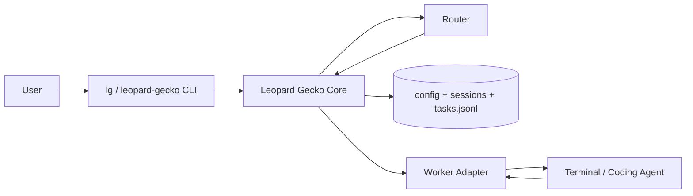

# Leopard Gecko — Technical Specification

> **Leopard Gecko** is a **context-routing orchestrator** that manages multiple coding agent terminal sessions behind a single user interface. The implementation language is **Python**.
> Product philosophy, workflow, and MVP scope share the same premises as [`init.md`](./init.md). This document further specifies **module structure, data contracts, concurrency, routing implementation strategy, CLI, and extension points** on top of that.

---

## 1. System Boundary

| Component | Responsibility |
|-----------|---------------|
| **Leopard Gecko Core** | Task creation, `sessions.json` / task log updates, routing decisions, session/global queue management, configuration loading |
| **Router (Judge)** | Takes `user_prompt`, `task_note`, session state/`task_history` as input and outputs `assigned_session_id` or `new_session` / `global_queue` decision |
| **Worker Adapter** | Plugin boundary that delivers **only user_prompt** to the actual coding agent (terminal session) and reports completion, failure, and heartbeat to Core |
| **Storage** | `config.json`, `sessions.json`, `tasks.jsonl` (append-only) |

Core **does not perform prompt rewriting (refine).** Even if the Router uses an LLM, its output is used **only for routing memos (`task_note`) and internal reasoning logs**, and only the **original `user_prompt`** is delivered to the Worker.



---

## 2. Python Tech Stack (Recommended)

| Area | Choice | Notes |
|------|--------|-------|
| Runtime | Python 3.12+ | Type hints, `TypedDict`, `dataclass` / Pydantic v2 |
| Packaging/Dependencies | Rye | [`init` user rules] |
| CLI | Typer + Rich | Subcommands, tables, progress display |
| Config/Schema | Pydantic Settings + JSON file loading | `config.json` validation |
| Concurrency | `asyncio` (optional) + file lock | Single machine MVP can also use sync + `filelock` |
| Testing | pytest | Core/Router pure logic focused |
| Style | Ruff | format + lint |

The Worker adapter is designed so that it is **not tied to specific terminal tools** (tmux, Cursor Agent CLI, etc.) — **only the interface is defined in Core**, and the MVP starts with a stub or minimal implementation.

---

## 3. Package/Module Structure (Draft)

```
leopard_gecko/
  pyproject.toml
  src/
    leopard_gecko/
      __init__.py
      cli/                 # Typer entry point
        main.py
      models/              # Pydantic: Task, Session, Config, Enums
        task.py
        session.py
        config.py
      store/               # JSON/JSONL read/write, locking, atomic updates
        paths.py
        sessions_repo.py
        tasks_log.py
      router/              # Routing policy + (optional) LLM client
        policy.py
        llm_router.py      # optional: only when API key is available
      orchestrator/        # "One user input" processing pipeline
        pipeline.py
      adapters/            # WorkerPort protocol implementations
        base.py
        noop.py
  tests/
```

**Dependency direction:** `cli` -> `orchestrator` -> `router`, `store`, `models`. `adapters` depend only on the **protocol defined by Core**.

---

## 4. Data Contracts

### 4.1 `config.json`

| Field | Type | Description |
|-------|------|-------------|
| `max_terminal_num` | int | Upper limit of terminals (sessions) that can be alive simultaneously |
| `session_idle_timeout_min` | int | Marked as dead candidate if no heartbeat beyond this time |
| `queue_policy` | object | e.g., `max_queue_per_session` (per-session queue length limit), rules for diverting to another session or global queue when exceeded |
| `data_dir` | string (optional) | State file root; defaults to `~/.leopard-gecko` or project `.leopard-gecko` |

### 4.2 `sessions.json` — Single Source of Truth (Session View)

- **Role:** Living session registry + **accumulated `task_history`** (basis for routing).
- **Concurrent writes:** Write to a short temporary file then replace with `rename`, or use exclusive lock with `filelock`. MVP may assume a single process, but since CLI and worker reports can overlap, it's safer to include **locking or atomic writes** from the start.

**Session entry (logical fields):**

| Field | Description |
|-------|-------------|
| `session_id` | Immutable identifier |
| `terminal_id` | External terminal/slot ID (filled by the adapter) |
| `status` | `idle` \| `busy` \| `blocked` \| `dead` |
| `current_task_id` | The task if currently running, otherwise null |
| `queue` | `task_id` string array (waiting in order) |
| `task_history` | Accumulated snapshots of completed, failed, and running tasks (same philosophy as init example) |
| `worktree_path` | Session-specific git worktree path. null when inactive |
| `worktree_branch` | Branch name checked out by the session worktree. null when inactive |
| `worktree_base_ref` | The ref/commit used as the base when creating the worktree. null when inactive |
| `created_at` / `last_heartbeat` | ISO8601 UTC |

### 4.3 `tasks.jsonl`

- **Append-only** event log: task creation, routing decision changes, queue state transitions, completion/failure.
- One line = one JSON object (distinguished by event type field).
- Maintained for **audit, reproduction, and debugging** purposes even if it overlaps with `sessions.json`.

### 4.4 Task (Runtime Model)

Maintained identically to [`init.md`](./init.md):

- `task_id`, `user_prompt`, `task_note`, `routing`, `queue_status`, `created_at`
- `queue_status`: `pending` \| `queued_in_session` \| `queued_globally` \| `running` \| `completed` \| `failed`

---

## 5. Routing Implementation Strategy

Routing is encapsulated as a **policy function**.

**Input:** New task (`user_prompt`, `task_note`), `config`, `sessions` snapshot, (optional) current global queue length.

**Output:** One of the following decisions:

- `AssignExisting(session_id)` — If idle, can be assigned immediately; if busy, added to that session's `queue`
- `CreateNewSession` — Only when below `max_terminal_num`
- `EnqueueGlobal` — Terminal limit or "no session to attach to," etc.

**MVP implementation options (staged):**

1. **Heuristic only:** Concatenate `task_note` + recent N `task_history` `user_prompt`s as strings for keyword/simple rules (zero cost, easy to reproduce).
2. **LLM router:** Structured output (JSON) for one of the above three + `reason`. Low temperature. **task_note is NEVER put into the Worker.**
3. **Hybrid:** Narrow candidates to 2-3 sessions with heuristics, LLM makes final selection only.

The priority from [`init.md`](./init.md) (natural continuation -> context rot avoidance -> new session -> global wait) is locked down in `policy.py` with **explicit comments + unit test cases**.

---

## 6. Orchestration Pipeline (One User Input)

1. **Input validation** — Reject empty prompts.
2. **task_id issuance** — Time + short random suffix for collision prevention.
3. **task_note generation** — A subset of Router or separate "note writing" LLM call (one or two lines). **This step's output is used only for storage and routing.**
4. **Load `sessions.json` (lock)** — Snapshot.
5. **Routing** — Apply the output from the above section.
6. **State update** — Update session `queue` / `current_task_id` / global queue structure.
7. **`tasks.jsonl` append** — Creation event + routing event.
8. **Atomic save of `sessions.json`.**
9. **Session worktree preparation** — If worktree mode is enabled, ensure per-session checkout directory.
10. **Worker adapter call** — If there's a "next task to execute," deliver only `user_prompt` (e.g., when a task is assigned to an idle session). Actual async execution is handled by the adapter.

If the Worker is in the background, Core can **synchronously "just dispatch"** and exit (CLI one-shot).

---

## 7.1 Per-Session Git Worktree (Additional Design)

When multiple sessions need to modify files in the same repository in parallel, per-session worktrees can be used instead of sharing a single `cwd`.

Core principles:

- A session creates a worktree only when needed. That is, it is prepared **just before the first dispatch, not at session creation time**.
- Subsequent tasks continuing in the same session **always reuse the same worktree**.
- In environments that don't use worktrees, the existing orchestrator `cwd` is used as-is.
- Even if a session becomes dead/blocked, it is not automatically deleted in the first stage. This is because debugging and manual recovery are safer.

Recommended implementation approach:

- Store `worktree_path`, `worktree_branch`, `worktree_base_ref` in `Session`.
- `pipeline.py` selects `session.worktree_path or self.cwd` as the actual execution path just before worker submit.
- Use `git worktree add` only when it's a git repository; fall back to shared `cwd` for non-git directories.
- Record the actual dispatch `cwd` in run metadata as well. This enables tracking which checkout was used during recovery.

This design does not conflict with the current `worker_context_id`.

- `worker_context_id` is agent thread/session identity
- `worktree_path` is filesystem workspace identity

In other words, a single session has both a **Codex context + git worktree**.

---

## 8. Worker Adapter Contract

```text
Protocol (conceptual):
  submit(session_id, user_prompt) -> None
  report_heartbeat(session_id) -> None   # or adapter periodically calls Core API
  on_task_complete(session_id, task_id, status, optional_summary) -> None
```

- **Mandatory:** The body delivered to the Worker is **`user_prompt`**.
- **Forbidden:** Merging `task_note` into the execution prompt.

In the MVP, only the pipeline is verified with a `noop` adapter, and it is later connected to tmux/agent CLI.

---

## 9. Heartbeat and Dead Sessions

- `last_heartbeat` is updated by the Worker or terminal monitoring process.
- When `session_idle_timeout_min` is exceeded, mark as **dead**, and `current_task_id` and `queue` are either redistributed to the global queue or marked as failed per policy (in the MVP, it's best to **lock this down with one explicit rule**).

[`init.md`](./init.md) exception #1 (shown alive in file but actual terminal terminated) is absorbed through this path.

---

## 10. CLI (Initial Commands)

| Command | Role |
|---------|------|
| `lg init` | Create data directory and default `config.json` |
| `lg submit "..."` | Submit one line of user original text -> execute pipeline |
| `lg status` | Session, queue, and global wait summary |
| `lg sessions` | `sessions.json` summary table |

For package distribution, the console script name is `leopard-gecko` or `lg` (both can be registered).

---

## 11. Test Strategy

- **Router / policy:** Pure functions + verify standard output against fixed `sessions` snapshot JSON.
- **Store:** No data corruption when updating twice simultaneously in a temporary directory (lock test).
- **Integration:** With `noop` adapter, verify event order in log after `submit`.

---

## 12. Security and Secrets

- LLM API keys are stored in environment variables or OS secret stores; **they are NOT written to repository JSON files.**
- Since `user_prompt` may contain sensitive information, log retention period and masking are separated into operational policy (MVP assumes local environment).

---

## 13. Roadmap (Technical)

| Phase | Content |
|-------|---------|
| **M0** | Models + store + CLI skeleton, heuristic router stub |
| **M1** | Full `sessions.json` / `tasks.jsonl` reflection, routing/queue rule unit tests |
| **M2** | LLM `task_note` + (optional) LLM router, environment variable configuration |
| **M3** | One actual Worker adapter + heartbeat |

Items marked as "excluded" in [`init.md`](./init.md) (multi-agent planner, DAG, automatic PR, etc.) are maintained as **non-goals** in the README/this document.

---

## 14. Summary

**Leopard Gecko** is a **thin session router** implemented in Python: original prompt preservation, `task_note` for internal routing only, accumulated history in `sessions.json` as the routing basis, and **only user_prompt is passed to the Worker** as the execution unit. This document is the technical baseline that specifies that implementation up to **modules, data contracts, concurrency, and Router phased introduction**.

The recommended next implementation step is to place **Pydantic schema drafts + `config` / `sessions` / `tasks` sample JSON** in the codebase and scaffold the M0 skeleton.
