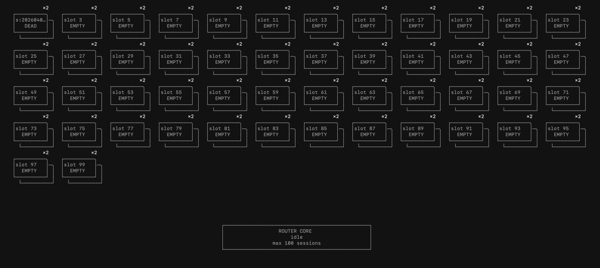

<p align="center">
  
</p>

<h1 align="center">Leopard Gecko</h1>

<p align="center">
  <strong>The First Context Engineer That Replaces You.</strong><br/>
  A context orchestrator that automatically routes and manages coding agent sessions.
</p>

<p align="center">
  <a href="https://discord.gg/8B2WBcAvM"></a>
</p>

<p align="center">
  
</p>

---

## Why Leopard Gecko?

**Context** is the biggest factor affecting coding agent performance. Existing solutions try to fix this with memory systems that summarize or strip content — but the real bottleneck isn't the model. It's the **human**.

In practice, humans:
- Ask unrelated questions within a single session
- Forget to start new sessions when context grows too long
- Lose track of which task ran in which session
- Don't notice when context saturation degrades output quality

We call managing these problems **Context Engineering** — and Leopard Gecko is the first tool that does it for you.

> **Leopard Gecko** manages coding agent sessions in the background. When you enter a prompt, it routes to the right session — or starts a new one if context rot is expected.

### How is this different from Sub Agents?

**Leopard Gecko has zero impact on your coding agent's quality.**

| | Sub Agents | Leopard Gecko |
|---|---|---|
| Role | Manager model rewrites & delegates tasks | Adapter that only **routes** between sessions |
| Risk | Poor manager instructions → wrong output | None — your original prompt is passed as-is |
| Quality depends on | Manager model capability | Your prompt + the agent's intrinsic performance |

---

## Architecture

```
  User Prompt
       |
       v
  +-----------+     +-----------------+
  |    CLI    | --> |   Orchestrator  |
  |  / TUI    |     |   (Pipeline)    |
  +-----------+     +--------+--------+
                             |
                    +--------v--------+
                    |  Context Router |  <-- LLM-based routing (OpenAI)
                    |  (AgentRouter)  |
                    +--------+--------+
                             |
              +--------------+--------------+
              |              |              |
        +-----v----+  +-----v----+  +------v---+
        | Session 1 |  | Session 2 |  | Session N |
        | (Codex)   |  | (Codex)   |  | (Codex)   |
        +-----------+  +-----------+  +-----------+
```

### Core Components

| Component | Description |
|---|---|
| **Orchestrator** | Task submission, worker polling, session lifecycle mgmt |
| **Context Router** | LLM-based routing — assigns tasks to the best session |
| **Worker Adapter** | Abstraction layer for coding agents (e.g., Codex) |
| **Store** | File-based atomic persistence (`sessions.json`, `tasks.jsonl`) |
| **TUI** | Interactive terminal UI built with Textual |

### Routing Decisions

The Router evaluates multiple signals to find the best session for each prompt:

- **Context usage** — how many turns have been consumed in each session
- **Task relevance** — what types of tasks have been executed or are queued in each session
- **Session capacity** — whether a session can accept more tasks without degradation

Based on these factors, it makes one of three decisions:

| Decision | When |
|---|---|
| `ASSIGN_EXISTING` | A session with relevant context and remaining capacity exists |
| `CREATE_NEW_SESSION` | No suitable session, or context rot / saturation is expected |
| `ENQUEUE_GLOBAL` | All sessions are at capacity |

---

## Getting Started

### Prerequisites

- [uv](https://docs.astral.sh/uv/) (recommended) or Python 3.12+
- OpenAI API key (required for LLM-based routing)
- Codex CLI (when used as worker backend)

### Installation

```bash
git clone https://github.com/your-org/leopard-gecko.git
cd leopard-gecko

uv sync
```

> `uv sync` automatically creates a virtual environment and installs all dependencies.
> If you prefer pip: `python3.12 -m venv venv && source venv/bin/activate && pip install -e .`

### Environment Setup

Copy the example file and fill in your API key:

```bash
cp .env.example .env
```

Then edit `.env`:

```bash
OPENAI_API_KEY=sk-xxxxxxxxxxxxxxxxxxxxxxxx
OPENAI_MODEL=gpt-5.4-mini          # optional, defaults to gpt-5.4
```

> `.env` is loaded automatically at startup via `python-dotenv`. Never commit this file — it's already in `.gitignore`.

### Initialize

```bash
lg init --worker-backend codex
```

---

## Usage: TUI (Recommended)

The easiest way to use Leopard Gecko. All features in a single interactive terminal:

```bash
lg tui
```

- **Submit tasks** — type prompts and submit without leaving the terminal
- **Monitor sessions** — see all active sessions, their status, and queued tasks in real time
- **View routing decisions** — watch as the Context Router assigns tasks to sessions
- **Track progress** — follow task lifecycle from `PENDING` to `COMPLETED`

> For most users, `lg tui` is all you need. The CLI below is available for scripting and automation.

---

## Usage: CLI

For scripting, CI/CD pipelines, or when you prefer individual commands:

```bash
# Submit a task — the router decides which session to use
lg submit "Add pagination to the users API endpoint"

# Check session & queue status
lg status

# List all sessions in detail
lg sessions

# Run background worker (polls and executes queued tasks)
lg worker --interval-sec 2.0

# Poll worker status once (instead of continuous loop)
lg poll
```

### CLI Command Reference

| Command | Description |
|---|---|
| `lg init` | Initialize data directory and config |
| `lg submit <prompt>` | Submit a new task and route it |
| `lg status` | Display session/queue summary |
| `lg sessions` | List all sessions in detail |
| `lg poll` | Poll worker status once |
| `lg worker` | Run background polling loop |
| `lg tui` | Launch interactive terminal UI |

Common options:

- `--data-dir` : Specify data directory (default: `~/.leopard-gecko`)
- `--worker-backend` : Select worker backend (`NOOP`, `CODEX`)

---

## Configuration

Settings are managed in `~/.leopard-gecko/config.json`.

```jsonc
{
  "max_terminal_num": 4, // Maximum concurrent sessions
  "session_idle_timeout_min": 30, // Session idle timeout (minutes)
  "queue_policy": {
    "max_queue_per_session": 5, // Max queue size per session
  },
  "router": {
    "backend": "AGENT", // LLM-based routing
    "agent": {
      "model": "gpt-5.4-mini", // Model for routing
      "history_limit": 5, // History entries for routing decisions
      "max_turns_per_session": 5, // Max turns per session
    },
  },
  "worker": {
    "backend": "CODEX", // Worker backend
  },
  "worktree": {
    "enabled": false, // Git worktree isolation (optional)
  },
}
```

---

## How It Works

### Task Lifecycle

```
PENDING → QUEUED_IN_SESSION / QUEUED_GLOBALLY / RUNNING → COMPLETED / FAILED
```

1. User enters a prompt
2. Orchestrator creates a task + generates a routing memo (`task_note`)
3. Context Router analyzes session history → makes a routing decision
4. Task is assigned to a session and executed by a worker
5. **Only the original prompt** is passed to the worker (routing memos stay internal)

### Session Lifecycle

```
IDLE → [task assigned] → BUSY → [done, queue empty] → IDLE
                               → [done, queue has next] → BUSY
IDLE → [timeout] → DEAD
```

### Git Worktree (Optional)

Each session gets an independent working directory, preventing conflicts when multiple sessions modify the same repo simultaneously.

---

## Supported Workers

| Backend | Status | Description |
|---|---|---|
| **Codex** | Supported | OpenAI Codex CLI subprocess |
| **Noop** | Testing | Returns completion immediately (for testing) |
| **Claude Code** | Planned | Can be added by implementing `WorkerPort` |

To add a new coding agent, implement `submit()` and `poll()` of the `WorkerPort` protocol.

---

## Design Principles

| Principle | Description |
|---|---|
| **Prompt Preservation** | Never modifies the user's original prompt |
| **Routing-Only Adapter** | Only routes between sessions — no impact on agent quality |
| **History-Driven Routing** | Decisions based on session task history |
| **Atomic Persistence** | Data integrity via file locking + atomic writes |
| **Pluggable Architecture** | Router, Worker, TaskNote are all protocol-based |

---

## Development

```bash
# Install with dev dependencies
uv sync --group dev

# Run tests
uv run pytest

# E2E tests (calls external services)
uv run pytest -m e2e

# Lint
uv run ruff check src/ tests/
```

---

## Roadmap

- **More coding agent support** — Claude Code, OpenCode, and others via `WorkerPort`
- **Improved routing logic** — smarter context analysis and session allocation strategies
- **Skills system** — adding composable skills for more refined workflows
- **MCP server** — expose Leopard Gecko as an MCP server for integration with other tools

---

## License

[Apache License 2.0](LICENSE)
